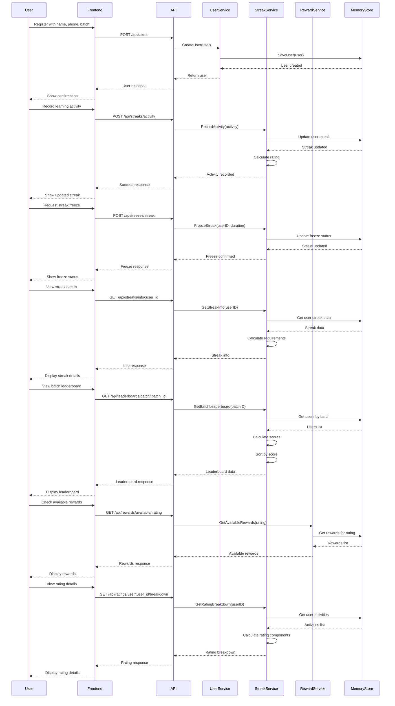

# Learning Activities Streak System

A robust Go-based backend system for tracking learning activities, managing user streaks, and implementing a reward system based on user performance.

## Features

- **User Management**
  - User registration and profile management
  - Batch-based user organization
  - User activity tracking

- **Streak System**
  - Daily activity tracking
  - Streak counting and maintenance
  - Streak break detection
  - Activity history
  - Streak freezing capability
  - Detailed streak requirements and milestones
  - Multiple streak types (Beginner, Intermediate, Advanced)

- **Rating System**
  - Dynamic rating calculation based on:
    - Streak consistency
    - Activity duration
    - Activity frequency
  - Rating tiers: Beginner → Novice → Intermediate → Expert
  - Rating breakdown and progress tracking

- **Leaderboard System**
  - Batch-specific leaderboards
  - Global top performers
  - Rating distribution visualization
  - Streak distribution analysis

- **Reward System**
  - Rating-based reward tiers
  - Progress tracking towards rewards
  - Reward history
  - Available rewards display

## System Architecture

The system follows a clean architecture pattern with the following components:

- **Handlers**: HTTP request handlers
- **Services**: Business logic layer
- **Models**: Data structures and entities
- **Storage**: Data persistence layer (in-memory for this implementation)

## API Endpoints

### User Management
- `POST /api/users` - Create new user
- `GET /api/users/:user_id` - Get user details

### Streak Management
- `POST /api/streaks/activity` - Record learning activity
- `GET /api/streaks/user/:user_id` - Get user streak information
- `GET /api/streaks/info/:user_id` - Get detailed streak information including requirements and milestones

### Streak Freeze Management
- `POST /api/freezes/streak` - Freeze a user's streak
- `DELETE /api/freezes/streak/:user_id` - Unfreeze a user's streak
- `GET /api/freezes/status/:user_id` - Get freeze status

### Rating System
- `GET /api/ratings/user/:user_id` - Get user rating
- `GET /api/ratings/user/:user_id/breakdown` - Get rating calculation breakdown

### Leaderboard
- `GET /api/leaderboards/batch/:batch_id` - Get batch leaderboard
- `GET /api/leaderboards/top` - Get top performers
- `GET /api/leaderboards/batch/:batch_id/stats` - Get leaderboard statistics
- `GET /api/leaderboards/batch/:batch_id/rating-distribution` - Get rating distribution
- `GET /api/leaderboards/batch/:batch_id/streak-distribution` - Get streak distribution

### Rewards
- `GET /api/rewards/user/:user_id` - Get user rewards
- `GET /api/rewards/reward/:reward_id` - Get reward details
- `GET /api/rewards/available/:rating` - Get available rewards for rating
- `GET /api/rewards/progress/:user_id` - Get reward progress

## Streak Types and Requirements

### Beginner Streak
- Minimum daily duration: 30 minutes
- Maximum gap allowed: 1 day
- Required activities: Videos, Questions, Flashcards
- Bonus multiplier: 1.0x
- Perfect for beginners starting their learning journey

### Intermediate Streak
- Minimum daily duration: 1 hour
- Maximum gap allowed: 1 day
- Required activities: Videos, Questions, Flashcards, Quizzes
- Bonus multiplier: 1.2x
- For committed learners looking to advance

### Advanced Streak
- Minimum daily duration: 2 hours
- Maximum gap allowed: 0 days
- Required activities: Videos, Questions, Flashcards, Quizzes, Projects
- Bonus multiplier: 1.5x
- For dedicated learners pursuing mastery

## Streak Freeze System

The system allows users to freeze their streaks under specific conditions:

- Minimum streak requirement: 7 days
- Maximum freezes allowed: 3
- Maximum freeze duration: 7 days per freeze
- Streak count and rating are preserved during freeze
- Automatic unfreeze when duration expires

## Streak Milestones

The system tracks progress through various milestones:
- 7 days: Weekly achievement
- 14 days: Bi-weekly milestone
- 21 days: Three-week mark
- 30 days: Monthly achievement
- 60 days: Two-month milestone
- 90 days: Quarterly achievement
- 180 days: Half-year milestone
- 365 days: Yearly achievement

## System Flow



## Getting Started

### Prerequisites

- Go 1.16 or higher
- Git

### Installation

1. Clone the repository:
```bash
git clone https://github.com/yourusername/learning-activities-streak.git
cd learning-activities-streak
```

2. Install dependencies:
```bash
go mod download
```

3. Run the application:
```bash
go run main.go
```

The server will start on `http://localhost:96`

## Testing

Run the test suite:
```bash
go test ./...
```

## Contributing

1. Fork the repository
2. Create your feature branch (`git checkout -b feature/AmazingFeature`)
3. Commit your changes (`git commit -m 'Add some AmazingFeature'`)
4. Push to the branch (`git push origin feature/AmazingFeature`)
5. Open a Pull Request

## License

This project is licensed under the MIT License - see the [LICENSE](LICENSE) file for details.

## Acknowledgments

- Built with [Gin](https://github.com/gin-gonic/gin) web framework
- Uses [UUID](https://github.com/google/uuid) for unique identifiers
- Inspired by gamification principles in learning platforms